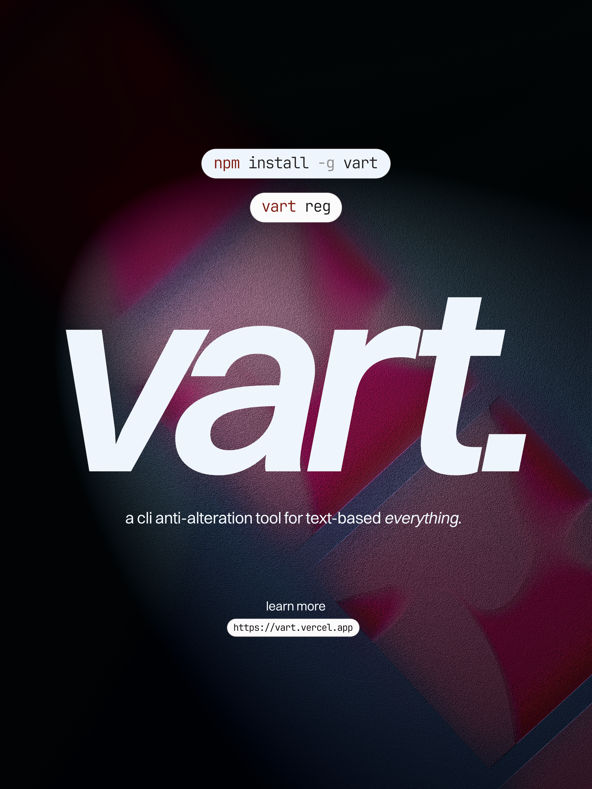

# vart (cli)



**vart** (verify article) is a small command-line tool for creating encrypted identities and signing/verifying text articles inside the vart ecosystem. the project uses a hybrid model:

- private data (identities, private metadata) is encrypted with a master secret.
- public fingerprints and optional authority signatures are embedded so others can perform public verification without the master secret.

this readme intentionally uses lowercase for branding.

---

## installation

install from npm (global):

```bash
npm install -g vart-cli
# or from source during development:
npm install -g .
```

there's also a provided installer for unix-like systems:

```bash
./install-vart.sh
```

the installer bootstraps a persisted master secret at `~/.vart_master_secret` if none is provided. do not commit that file.

---

## quick start

1. initialize authority keys (optional, creates an authority keypair under `~/.vart/`):
```bash
vart init
```

2. register an identity (interactive):
```bash
vart reg
```

or non-interactive:
```bash
vart reg --name "alice example" --email "alice@example.com" --verify "https://example.com/alice.txt"
```

3. sign an article:
```bash
vart sign article.txt alice.vart
```

4. public verification (anyone, no master secret required):
```bash
vart verify-public alice.vart
```

5. full verification (requires master secret to decrypt identity details):
```bash
vart verify alice.vart
```

6. export a signed article's plaintext:
```bash
vart export article.vart [output.txt]
```

7. show info about a .vart file:
```bash
vart info file.vart
```

8. join an organization (writer + org .vart files):
```bash
vart join writer.vart org.vart
```

9. check trust via verification URLs embedded in an identity:
```bash
vart trust alice.vart
```

10. view local configuration status:
```bash
vart status
```

---

## environment variables

recommended runtime configuration options:

- `MASTER_SECRET_HEX` — preferred. a 64-char hex string representing the master secret. if provided, this is used instead of generating/persisting a file.
- `MASTER_SECRET_FILE` — optional path to persisted secret (default: `~/.vart_master_secret`).
- `AUTHORITY_PUBLIC_KEY_PEM` — optional. authority public key pem text (used for public verification).
- `AUTHORITY_PRIVATE_KEY_PEM` — optional. authority private key pem text (used to sign fingerprints at registration).
- `AUTHORITY_NAME` — optional friendly name for the authority (default: `VART-Authority`).

note: it's safer to store secrets in a secret manager (vault, aws secrets manager) and set `MASTER_SECRET_HEX` in the runtime environment.

---

## file format (brief)

a `.vart` file is a json wrapper:

```json
{
  "type": "identity" | "signed_article",
  "version": "1.0",
  "data": "<encrypted-hex-string>",
  "public": {
    "authority": "<authority-name>",
    "authorityPublicKey": "<pem or null>",
    "fingerprint": "<sha256-hex>",
    "authoritySignature": "<base64 or null>",
    "signedAt": "<timestamp>"
  }
}
```

- `data` is the ciphertext (aes-256-gcm hex format).
- `public.fingerprint` is the canonical sha256 fingerprint of the canonicalized identity (stable key ordering).
- `authoritySignature` is present only if the identity was signed by the authority private key.

---

## why authority signature can be null

if you see `authoritySignature: null` it means the identity was created without the authority private key available (or signing failed). public verification will not be possible until the signature is added.

options to fix:
- run `vart init` to generate authority keys and re-register the identity with `AUTHORITY_PRIVATE_KEY_PEM` present; or
- sign the existing `.vart` file in-place using your authority private key (there's a helper script in the repo examples, or you can call the `sign-vart-file.js` approach described in docs).

---

## security notes (read before production)

- do not commit persisted master secret files or private keys to git. add `~/.vart_master_secret`, `.vart/`, and `*.vart` to `.gitignore`.
- treat `MASTER_SECRET_HEX` and `AUTHORITY_PRIVATE_KEY_PEM` as highly sensitive.
- if `MASTER_SECRET` is stolen: attacker can decrypt identities and read private fields, but they cannot create valid authority-signed identities (unless authority private key is also stolen).
- if the authority private key is stolen: attacker can create forged, signed identities. protect it as tightly as the master secret.
- plan for key rotation. rotate master secret carefully (re-encrypt artifacts or version them), and record versions in `.vart.public` when migrating.

---

## troubleshooting

- "authority signature is null": ensure `AUTHORITY_PRIVATE_KEY_PEM` is present in the same shell and valid, or run `vart init` and re-register/sign the file.
- "decryption failed": most likely wrong `MASTER_SECRET_HEX` or different persisted secret. confirm `MASTER_SECRET_HEX` or the persisted file at `~/.vart_master_secret`.
- fetch/trust checks timing out or failing: network fetches have a timeout and max size; ensure URLs are reachable and returning expected content.

---

## contributing & tests

please add unit tests for:
- encrypt/decrypt round trips
- register -> verify-public -> verify (full)
- sign -> verify-article

setup ci to run tests and scan for accidental secrets (git-secrets or similar).

---

## license

pick an appropriate open source license and add it to the repo (e.g., mit).
